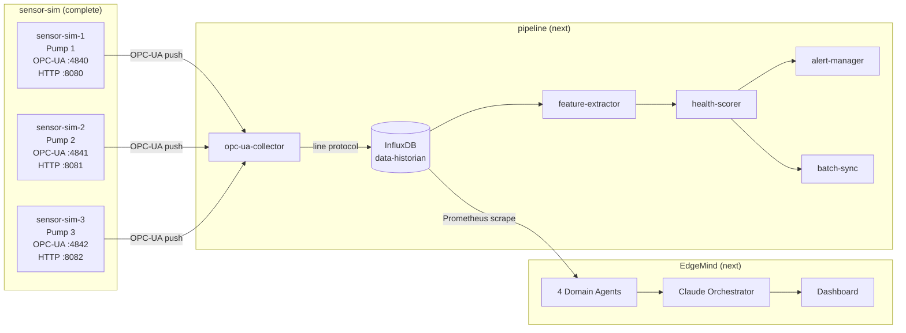
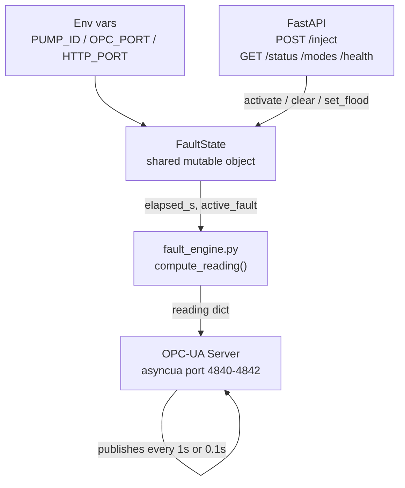
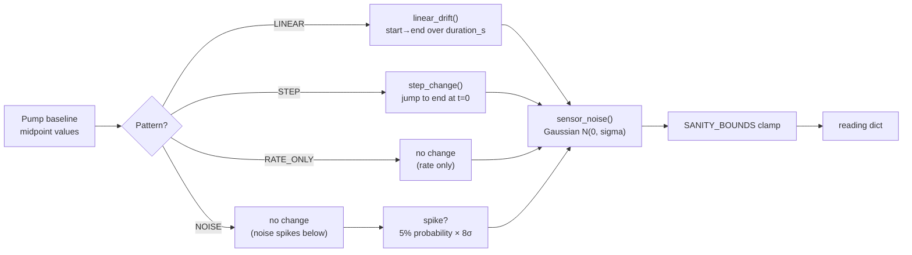
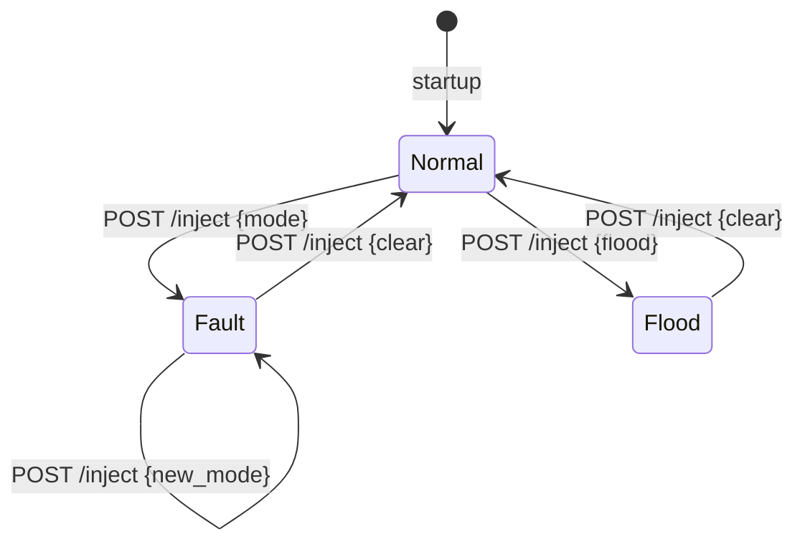
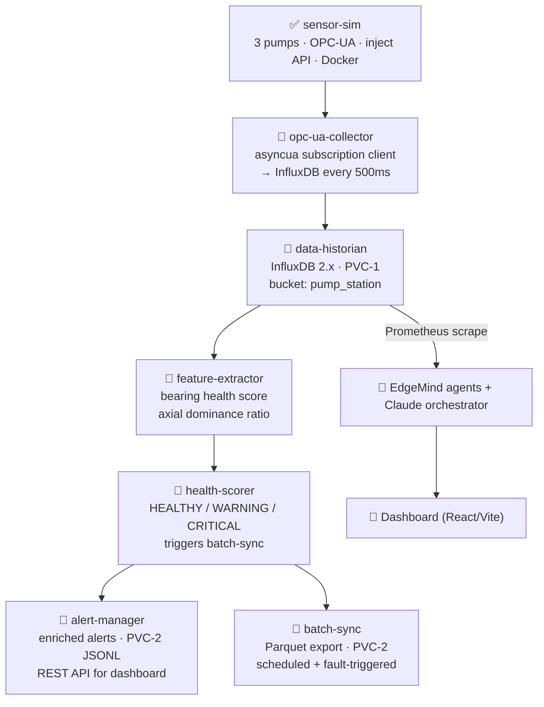

# EdgeMind — Technical Documentation
## sensor-sim layer (complete)

---

## 1. Design Constraints

Four hard rules that shaped every decision:

1. **Zero instrumentation of the monitored workload.** EdgeMind detects anomalies from standard kubelet/node-exporter/cAdvisor metrics only. No custom Prometheus metrics on any pipeline pod.
2. **Real protocols.** Sensors are genuine OPC-UA servers (`asyncua`). The collector will be a genuine OPC-UA subscription client.
3. **Organic resource signatures.** Every CPU spike, PVC write burst, and network flood is caused by real work — not injected fake metrics.
4. **Honest naming.** Statistical detection is statistical detection. AI reasoning is AI reasoning.

---

## 2. System Context



---

## 3. Sensor Simulation — Architecture

Each sensor-sim container is a self-contained Python process running three concurrent tasks:



**`asyncio.gather`** runs the OPC-UA emit loop and the FastAPI HTTP server concurrently on one event loop — no threading.

---

## 4. Data Model — What Each Pump Emits

Five raw physical parameters per tick. No derived scores at this layer — bearing health is computed downstream by `feature-extractor`.

| Parameter | Unit | Physical meaning |
|---|---|---|
| `vibration_radial` | mm/s RMS | Side-to-side shaft movement |
| `vibration_tangential` | mm/s RMS | Rotational-direction movement |
| `vibration_axial` | mm/s RMS | Along shaft axis — primary bearing-wear indicator |
| `temperature` | °C | Motor casing heat |
| `rpm` | rev/min | Shaft speed |

Plus a UTC `timestamp` (ISO-8601).

### Baseline ranges (normal operation)

| Parameter | Pump 1 (75 kW, 1450 RPM) | Pump 2 (45 kW, 1450 RPM) | Pump 3 (7.5 kW, 960 RPM) |
|---|---|---|---|
| Vibration radial | 1.8 – 2.3 | 1.4 – 1.9 | 0.8 – 1.2 |
| Vibration tangential | 1.5 – 2.0 | 1.2 – 1.6 | 0.6 – 1.0 |
| Vibration axial | 0.8 – 1.2 | 0.6 – 1.0 | 0.3 – 0.6 |
| Temperature (°C) | 48 – 55 | 43 – 50 | 38 – 45 |
| RPM | 1448 – 1455 | 1449 – 1456 | 958 – 963 |

Gaussian noise applied on every tick: vibration ±0.15 mm/s, temperature ±0.5 °C, RPM ±2.

Pump 3 is a 6-pole motor at 960 RPM — genuinely different baseline. EdgeMind's agents must hold per-pod baselines, not global thresholds.

---

## 5. OPC-UA Address Space

```
Objects/
  PumpStation/                    ← Folder  (ns=2)
    Pump1/                        ← Object  (ns=2)
      VibrationRadial             ← Float   (mm/s RMS)
      VibrationTangential         ← Float   (mm/s RMS)
      VibrationAxial              ← Float   (mm/s RMS)
      Temperature                 ← Float   (°C)
      RPM                         ← Float   (rev/min)
      Timestamp                   ← DateTime
    Pump2/ (same nodes)
    Pump3/ (same nodes)
```

Namespace URI: `http://edgemind.abb/pump-station` (registered as index 2).
All 6 nodes per pump are writable — the emit loop updates them every tick.

---

## 6. Fault Engine

### 6.1 Value generation pipeline



`compute_reading(pump_id, fault_state, t)` is a **pure function** — given the same inputs it produces the same output (modulo noise). The optional `t` parameter allows tests to pass an explicit elapsed time for deterministic assertions.

### 6.2 Fault patterns

| Pattern | Behaviour | Used by |
|---|---|---|
| `LINEAR` | `linear_drift(start, end, duration_s, elapsed_s)` — clamps at `end` | imbalance, seal_leak, bearing_fault, overheat |
| `STEP` | `step_change(end, elapsed_s)` — target value from t=0 | cavitation |
| `RATE_ONLY` | Values track baseline; only emit cadence changes (10 Hz) | flood |
| `NOISE` | Baseline values + 5% chance of 8× sigma spike per tick | sensor_noise |

### 6.3 Fault definitions

| Fault | Pump | Duration | What changes |
|---|---|---|---|
| `imbalance` | pump1 | 240 s | radial 2.0→5.8, tangential 1.7→5.1, temp 52→61 °C |
| `seal_leak` | pump1 | 360 s | temp 51→74 °C, axial 1.0→2.6, RPM 1451→1443 |
| `bearing_fault` | pump2 | 300 s | axial 0.8→4.8 mm/s (ISO Zone B → Zone D) |
| `cavitation` | pump2 | sustained | radial+tangential 1.6→5.2, RPM 1452→1438, temp 47→53 °C |
| `flood` | pump2 | sustained | 10 Hz emission; values unchanged |
| `overheat` | pump3 | 300 s | temp 42→79 °C, RPM 960→951, radial 1.0→1.7 |
| `sensor_noise` | any | sustained | 5% of ticks: 8× sigma spike on all params |

Combined scenarios (e.g. `flood` + `overheat`) are achieved by injecting faults on two different containers independently — no special engine mode needed.

---

## 7. FaultState — Shared Mutable Object

One `FaultState` instance lives in `main.py`. The emit loop reads it every tick; the inject API writes it on every `POST /inject`.



State fields:
- `mode` — active fault name, or `None`
- `duration_s` — intended duration (advisory; engine clamps at end value)
- `started_at` — wall-clock epoch at activation, used to compute `elapsed_s()`
- `flood` — boolean; the emit loop reads this to pick 0.1s or 1.0s sleep period

---

## 8. Emit Loop — Cadence

```mermaid
sequenceDiagram
    participant Loop as emit_loop
    participant FS as FaultState
    participant FE as fault_engine
    participant OPC as OPC-UA nodes

    loop every tick
        Loop->>FS: elapsed_s()
        Loop->>FE: compute_reading(pump_id, fault_state, t=elapsed)
        FE-->>Loop: reading dict
        Loop->>OPC: update_nodes(reading)
        Loop->>FS: flood?
        alt flood = True
            Loop->>Loop: sleep 0.1s  (10 Hz)
        else
            Loop->>Loop: sleep 1.0s  (1 Hz)
        end
    end
```

The `flood` flag is written by the inject API when `mode="flood"` is activated. The emit loop only reads it — it never sets it.

---

## 9. Inject API Flow

```mermaid
sequenceDiagram
    participant Client as curl / test
    participant API as inject_server
    participant FS as FaultState
    participant Loop as emit_loop

    Client->>API: POST /inject {"mode":"bearing_fault","duration_s":300}
    API->>API: validate mode ∈ FAULT_DEFS
    API->>FS: activate("bearing_fault", 300)
    FS-->>API: mode="bearing_fault", started_at=now
    API-->>Client: {"ok":true,"active_fault":"bearing_fault"}
    Note over Loop: next tick (≤1s later)
    Loop->>FS: elapsed_s() → 0.8s
    Loop->>Loop: compute_reading(..., t=0.8) → axial≈0.81
    Loop->>Loop: OPC node updated

    Client->>API: POST /inject {"mode":"clear"}
    API->>FS: clear()
    API-->>Client: {"ok":true,"active_fault":null}
```

---

## 10. Docker Packaging

### Image design

One image runs as any of the three pumps — identity is purely from environment variables set by `docker-compose.yml`. The image excludes tests and `__pycache__` via `.dockerignore`.

```
Base:     python:3.11-slim
WORKDIR:  /app
Files:    pump_config.py  fault_engine.py  opc_server.py  inject_server.py  main.py
Ports:    4840 (OPC-UA)  8080 (HTTP)     ← defaults; overridden per container
Health:   GET /health every 15s
```

### Port mapping

| Container | PUMP_ID | OPC-UA | HTTP |
|---|---|---|---|
| sensor-sim-1 | pump1 | 4840 | 8080 |
| sensor-sim-2 | pump2 | 4841 | 8081 |
| sensor-sim-3 | pump3 | 4842 | 8082 |

---

## 11. ISO 10816-3 Reference

| Zone | Range | Status |
|---|---|---|
| A | ≤ 1.4 mm/s | Newly commissioned, excellent |
| B | 1.4 – 2.8 mm/s | Acceptable, long-term operation |
| C | 2.8 – 4.5 mm/s | Investigate, restricted operation |
| D | > 4.5 mm/s | Damage occurring, take out of service |

`bearing_fault` progresses axial vibration: Zone B (0.8 mm/s) → Zone D (4.8 mm/s) over 5 minutes. Temperature: warning > 60 °C, critical > 75 °C.

---

## 12. Test Suite

45 automated tests, all passing. No Docker required to run.

| File | Tests | Scope |
|---|---|---|
| `test_faults.py` | 12 | Pure math: all fault modes, helpers, sanity bounds, FaultState lifecycle |
| `test_server.py` | 25 | OPC-UA address space, node types, value round-trips, bearing_fault/cavitation/flood via live server, emit loop cadence |
| `test_inject.py` | 8 | Inject API routes, mode validation, state reflection, default duration |

**Flood cadence test** (`test_emit_loop_flood_ticks_faster_than_normal`): instruments `update_nodes()` with a counter and measures actual ticks over 1 second. Normal: ≤3 ticks. Flood: ≥5 ticks.

**pytest-asyncio note:** `asyncio_default_test_loop_scope = module` is required in `pytest.ini`. Without it, tests run on per-function event loops while the server fixture runs on a module-scoped loop — the server's TCP callbacks never fire during tests, causing all client requests to time out.

---

## 13. What's Next


